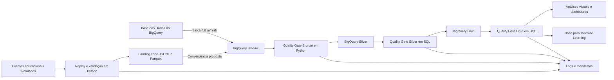
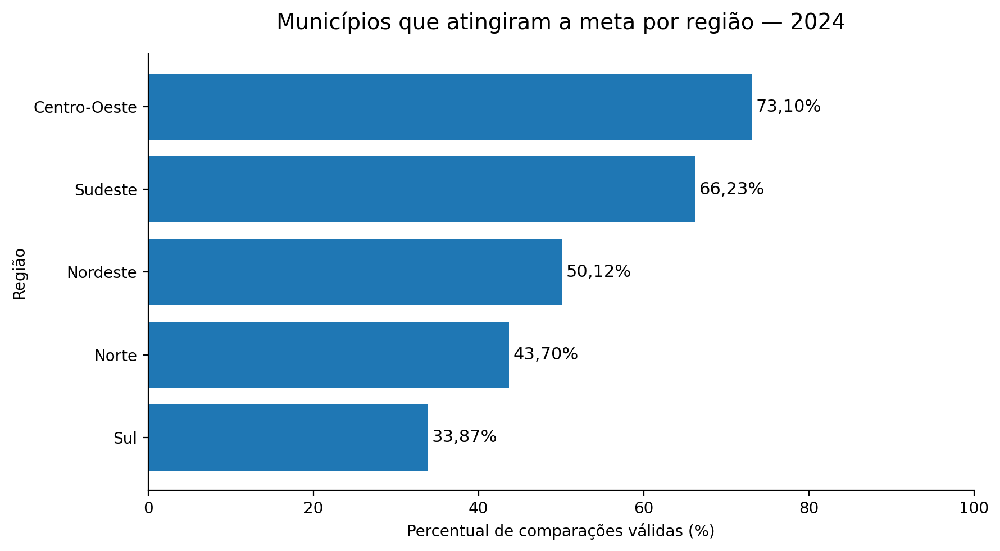
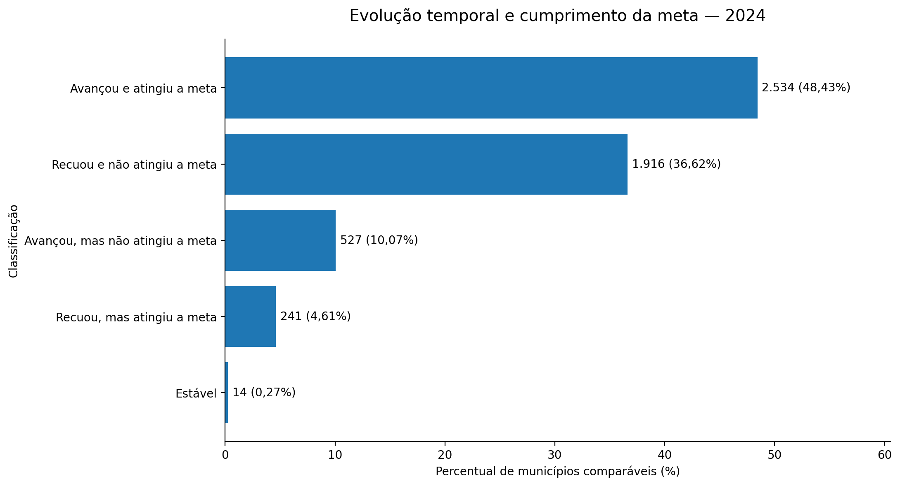
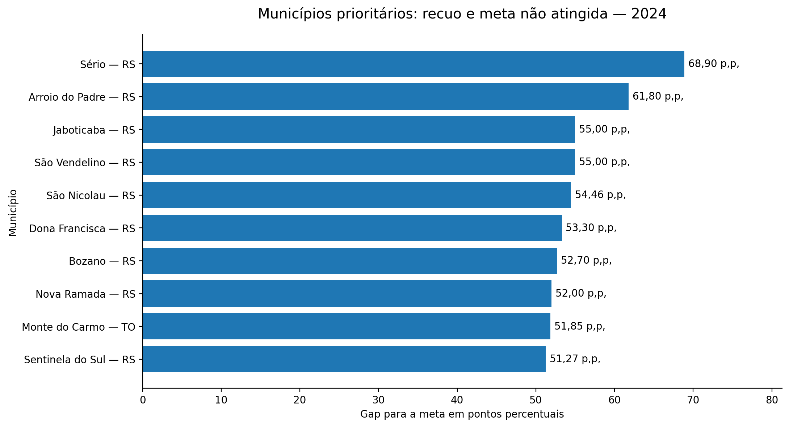

# Alfabetiza Brasil Data Platform

Pipeline híbrida de dados em GCP para integração, tratamento e análise de indicadores de alfabetização infantil no Brasil.

A solução combina ingestão batch, streaming simulado, Arquitetura Medalhão, quality gates, observabilidade, FinOps e análises territoriais utilizando Google Colab, Python, SQL e BigQuery.

> Projeto desenvolvido no contexto do Tech Challenge da Pós-Graduação em Data Science e Inteligência Artificial da FIAP.

---

## Destaques

| Indicador | Resultado |
|---|---:|
| Registros de alunos ingeridos e preservados | 3.867.999 |
| Municípios com resultado em 2024 | 5.352 |
| Comparações válidas entre resultado e meta | 5.232 |
| Estruturas analíticas na Gold | 6 tabelas + 1 view |
| Quality gates aprovados | Bronze, Silver e Gold |
| Eventos recebidos no streaming simulado | 20 |
| Eventos aceitos / rejeitados | 15 / 5 |
| Base elegível para Machine Learning | 3.354.661 registros |

---

## Contexto e problema

A alfabetização infantil é um dos principais indicadores do desenvolvimento educacional e social. No Brasil, a análise do Indicador Criança Alfabetizada exige integrar informações distribuídas entre diferentes granularidades e estruturas, como microdados de alunos, resultados territoriais e metas nacionais, estaduais e municipais.

Sem uma plataforma integrada, torna-se mais difícil:

- comparar resultados e metas;
- acompanhar a evolução dos indicadores;
- identificar desigualdades territoriais;
- localizar municípios prioritários;
- garantir qualidade, consistência e rastreabilidade;
- preparar dados confiáveis para análises e inteligência artificial.

Como referência de consistência, foi utilizado o ponto de corte de **743 pontos na escala de proficiência**, a partir do qual o registro é classificado como alfabetizado na fonte analisada.

---

## Fonte de dados

A principal fonte é o dataset público:

```text
basedosdados.br_inep_avaliacao_alfabetizacao
```

disponibilizado pela Base dos Dados no BigQuery.

Foram integradas sete tabelas:

- `alunos`;
- `dicionario`;
- `meta_alfabetizacao_brasil`;
- `meta_alfabetizacao_uf`;
- `meta_alfabetizacao_municipio`;
- `municipio`;
- `uf`.

O enriquecimento territorial utiliza também o diretório oficial de municípios da Base dos Dados.

Mais detalhes:

- [Dicionário de dados](docs/dicionario_dados.md)

---

## Objetivo

Construir uma plataforma capaz de:

- processar dados históricos por ingestão batch;
- simular eventos em tempo quase real;
- organizar os dados nas camadas Bronze, Silver e Gold;
- integrar informações educacionais e territoriais;
- validar a qualidade antes da progressão entre camadas;
- gerar logs, manifestos e evidências de execução;
- disponibilizar estruturas analíticas para dashboards;
- preparar uma base segura para futuras aplicações de Machine Learning;
- transformar os dados em diagnósticos territoriais úteis para tomada de decisão.

---

## Arquitetura da solução



> A ligação tracejada representa uma evolução produtiva. Na implementação atual, os eventos simulados permanecem isolados dos dados oficiais para preservar a integridade das fontes públicas.

Documentação:

- [Arquitetura detalhada](docs/arquitetura/arquitetura.md)
- [Decisões técnicas](docs/decisoes_tecnicas.md)
- [Monitoramento e observabilidade](docs/monitoramento/monitoramento.md)
- [Estratégia de FinOps](docs/finops/finops.md)

---

## Camadas da Arquitetura Medalhão

### Bronze

Preserva os dados ingeridos com o mínimo de transformação, mantendo correspondência com as fontes e rastreabilidade da carga.

### Silver

Executa:

- limpeza e padronização;
- conversão de tipos;
- normalização de chaves;
- integração entre entidades;
- enriquecimento territorial;
- preservação de valores ausentes legítimos;
- validações de consistência.

### Gold

Disponibiliza estruturas analíticas para:

- indicadores por município;
- consolidação por UF e Brasil;
- comparação entre metas e resultados;
- evolução temporal;
- resumo regional;
- análise por aluno;
- preparação de dados para Machine Learning.

---

## Pipelines

### 1. Ingestão batch

O pipeline batch realiza `full refresh` das sete fontes para a camada Bronze no BigQuery.

A estratégia foi escolhida por simplicidade, rastreabilidade e reprodutibilidade no contexto acadêmico. Em produção, pode evoluir para cargas incrementais.

- [Notebook batch](notebooks/01_pipeline_batch.ipynb)
- [SQL de full refresh](sql/bronze/01_bronze_full_refresh.sql)

### 2. Streaming simulado

O pipeline simula a chegada sequencial de eventos educacionais em tempo quase real.

A execução realiza:

- geração e replay de eventos;
- processamento evento a evento;
- validação de schema e regras de negócio;
- separação entre eventos aceitos e rejeitados;
- persistência em JSONL e Parquet;
- geração de logs, resumo e manifesto.

| Métrica | Resultado |
|---|---:|
| Eventos recebidos | 20 |
| Eventos aceitos | 15 |
| Eventos rejeitados | 5 |
| Formatos gerados | JSONL e Parquet |
| Escrita nos dados oficiais | Não |
| Destino conceitual | Bronze de eventos |

Os eventos aceitos em Parquet representam uma **landing zone simulada**. Em produção, seriam encaminhados para uma Bronze de eventos por serviços gerenciados, como Pub/Sub e um consumidor em Cloud Run, Cloud Functions ou Dataflow.

A tabela Gold foi utilizada somente como fonte de amostras reais para produzir payloads verossímeis. Ela não representa a origem dos eventos em uma arquitetura de produção.

- [Notebook de streaming](notebooks/02_streaming_simulado.ipynb)
- [Artefatos do streaming](artifacts/streaming/)

### 3. Pipeline end-to-end

O pipeline principal executa a progressão:

```text
Bronze → Quality Gate → Silver → Quality Gate → Gold → Quality Gate
```

Cada etapa aguarda a conclusão da anterior. Uma reprovação interrompe o fluxo antes da camada seguinte.

Também são registrados:

- identificador da execução;
- início, fim e duração;
- status de cada etapa;
- bytes processados;
- mensagens de erro;
- resultados dos quality gates.

- [Notebook end-to-end](notebooks/03_pipeline_end_to_end.ipynb)

### 4. Análises visuais

O notebook final consulta exclusivamente a camada Gold para:

- validar os resultados consolidados;
- comparar indicadores e metas;
- analisar evolução temporal;
- identificar desigualdades territoriais;
- localizar municípios prioritários;
- estudar a associação entre participação e resultado.

- [Notebook de análises visuais](notebooks/04_analises_visuais.ipynb)
- [Tabelas exportadas](artifacts/analises/tabelas/)
- [Manifesto das análises](artifacts/analises/manifesto_analises.json)

---

## Tecnologias e justificativas

| Tecnologia | Papel | Justificativa |
|---|---|---|
| BigQuery | Bronze, Silver e Gold | Processamento analítico serverless e integração direta com a fonte |
| Google Colab | Desenvolvimento e orquestração | Ambiente acessível e reproduzível para execução acadêmica |
| Python | Batch, streaming, logs e validações | Flexibilidade para orquestração, eventos e metadados |
| SQL | Transformações e quality gates | Clareza, auditabilidade e eficiência no BigQuery |
| Parquet | Landing zone do streaming | Formato colunar, comprimido e adequado para análise |
| JSONL | Eventos e logs estruturados | Formato sequencial simples para replay e inspeção |
| Pandas | Consolidação dos resultados | Apoio à inspeção, exportação e análise |
| Matplotlib | Visualizações | Geração reprodutível dos gráficos analíticos |
| Mermaid | Arquitetura | Diagrama textual, versionável e reproduzível |
| GitHub | Governança | Branches, commits, Pull Requests e documentação |

---

## Estruturas produzidas

### Bronze — 7 tabelas

- `alunos`
- `dicionario`
- `meta_alfabetizacao_brasil`
- `meta_alfabetizacao_uf`
- `meta_alfabetizacao_municipio`
- `municipio`
- `uf`

### Silver — 7 tabelas

- `alunos`
- `municipio`
- `uf`
- `dim_municipio`
- `meta_alfabetizacao_brasil`
- `meta_alfabetizacao_uf`
- `meta_alfabetizacao_municipio`

### Gold — 6 tabelas e 1 view

- `indicador_municipio`
- `indicador_uf`
- `indicador_brasil`
- `evolucao_municipio`
- `resumo_regiao`
- `aluno_analitico`
- `base_ml_aluno` — view

---

## Qualidade de dados

A solução verifica:

- existência das tabelas;
- correspondência de volume entre origem e Bronze;
- valores ausentes;
- duplicidades;
- unicidade de chaves;
- integridade referencial;
- consistência entre tabelas;
- regras analíticas da Gold;
- ausência de vazamento direto na base de Machine Learning.

### Bronze

O quality gate foi implementado em Python por utilizar metadados e tratamento de exceções da API do BigQuery.

- [Quality gate Bronze](src/quality/validate_bronze.py)

### Silver e Gold

Os quality gates foram implementados em SQL.

- [Quality gate Silver](sql/quality/10_quality_gate_silver.sql)
- [Quality gate Gold](sql/quality/11_quality_gate_gold.sql)

As validações confirmaram:

- 3.867.999 registros de alunos preservados;
- ausência de duplicidade na chave `(ano, id_aluno)`;
- integridade dos relacionamentos territoriais;
- preservação dos valores ausentes presentes na fonte;
- coerência da classificação oficial com o corte de 743 pontos;
- ausência de variáveis diretamente derivadas do alvo na base de Machine Learning.

---

## Resultados da análise

### Cumprimento das metas

Em 2024, a camada Gold reuniu **5.352 municípios com resultado de alfabetização**.

- **5.232** possuíam também meta disponível;
- **2.788** atingiram ou superaram a meta — **53,29%**;
- **2.444** não atingiram a meta — **46,71%**;
- **120** não possuíam meta disponível;
- nenhum município estava sem resultado.

Entre os municípios que não atingiram a meta:

- gap médio: **11,28 pontos percentuais**;
- gap mediano: **8,60 pontos percentuais**;
- terceiro quartil: **15,86 pontos percentuais**;
- maior gap observado: **68,90 pontos percentuais**.

### Desigualdade regional

O percentual de municípios que atingiram a meta variou de forma expressiva:

- Centro-Oeste: **73,10%**;
- Sudeste: **66,23%**;
- Nordeste: **50,12%**;
- Norte: **43,70%**;
- Sul: **33,87%**.



O Sul apresentou resultado médio de 64,68%, mas meta média de 72,31%, o que ajuda a explicar o menor percentual de cumprimento. Entre os municípios da região que ficaram abaixo da meta, o gap médio foi de **15,57 pontos percentuais**.

### Cobertura por UF

O ranking estadual considerou **24 UFs com ao menos uma comparação municipal válida**.

- Acre possuía 22 municípios com resultado, mas nenhuma meta disponível;
- Distrito Federal e Roraima não apresentaram registros municipais na base de 2024;
- as 120 lacunas identificadas eram ausências de meta, não de resultado.

Entre as UFs com comparações válidas:

- Ceará: **91,30%** dos municípios atingiram a meta;
- Goiás: **80,66%**;
- Minas Gerais: **79,53%**;
- Rio Grande do Sul: **9,50%**;
- Bahia: **19,04%**;
- Amazonas: **27,08%**.

### Evolução entre 2023 e 2024

Entre os **5.232 municípios com resultados comparáveis**:

- **3.061** avançaram — **58,51%**;
- **2.157** recuaram — **41,23%**;
- **14** permaneceram estáveis — **0,27%**.

Outros 120 municípios não possuíam base comparável em 2023.

O avanço foi territorialmente desigual:

- Centro-Oeste: 75,05% avançaram;
- Sudeste: 72,14%;
- Norte: 61,18%;
- Nordeste: 57,65%;
- Sul: apenas 31,12%.

O Sul foi a única região com variação média negativa, de **−8,24 pontos percentuais**.

### Evolução e cumprimento da meta

O cruzamento entre evolução temporal e cumprimento da meta revelou quatro grupos principais:

| Classificação | Municípios | Percentual |
|---|---:|---:|
| Avançou e atingiu a meta | 2.534 | 48,43% |
| Recuou e não atingiu a meta | 1.916 | 36,62% |
| Avançou, mas não atingiu a meta | 527 | 10,07% |
| Recuou, mas atingiu a meta | 241 | 4,61% |
| Estável | 14 | 0,27% |



O grupo mais crítico, formado pelos municípios que recuíram e não atingiram a meta, apresentou:

- queda média de **12,63 pontos percentuais**;
- gap médio de **13,71 pontos percentuais**.

No Sul, **62,24%** dos municípios analisados pertenciam ao grupo crítico, com queda média de **17,21 pontos percentuais** e gap médio de **16,45 pontos percentuais**.

### Participação na avaliação

A correlação geral entre participação e resultado foi positiva, mas fraca:

```text
r = 0,284
```

As médias apresentaram um gradiente:

| Faixa de participação | Resultado médio | Municípios que atingiram a meta |
|---|---:|---:|
| Abaixo de 80% | 51,87% | 35,89% |
| 80% a 89,99% | 58,78% | 46,35% |
| 90% a 94,99% | 63,35% | 53,47% |
| 95% ou mais | 69,58% | 63,72% |

A associação não demonstra causalidade. Municípios com maior capacidade administrativa e melhores condições educacionais podem apresentar simultaneamente maior participação e melhor resultado.

### Municípios prioritários

O ranking final considerou municípios que:

- recuíram entre 2023 e 2024;
- não atingiram a meta em 2024;
- apresentaram resultado e meta disponíveis.



Os maiores gaps foram encontrados em:

1. Sério–RS — **68,90 p.p.**;
2. Arroio do Padre–RS — **61,80 p.p.**;
3. Jaboticaba–RS — **55,00 p.p.**;
4. São Vendelino–RS — **55,00 p.p.**;
5. São Nicolau–RS — **54,46 p.p.**.

**Nove dos dez primeiros municípios do ranking pertencem ao Rio Grande do Sul.**

Essas variações extremas devem orientar investigações adicionais sobre composição das turmas, quantidade de alunos, contexto territorial e metodologia da avaliação. O ranking representa uma ferramenta de priorização, não uma explicação causal do desempenho.

---

## Preparação para Machine Learning

A view `gold.base_ml_aluno` contém somente avaliações válidas e utiliza a classificação oficial como variável-alvo:

```text
target_alfabetizado
```

Para reduzir data leakage, foram excluídas:

- proficiência;
- classificação recalculada pelo corte de 743 pontos;
- indicador de coerência entre a classificação oficial e a calculada.

A base contém **3.354.661 registros**, divididos de forma determinística:

| Divisão | Registros | Percentual |
|---|---:|---:|
| Treino | 2.347.122 | 69,97% |
| Validação | 503.191 | 15,00% |
| Teste | 504.348 | 15,03% |

Os identificadores foram preservados para rastreabilidade, mas não devem ser utilizados como variáveis preditoras.

---

## Decisões arquiteturais e trade-offs

- **Full refresh:** simplifica reprodução e auditoria, mas não é ideal para volumes e frequências maiores.
- **Streaming isolado:** evita mistura entre eventos simulados e dados públicos oficiais.
- **Python no quality gate Bronze:** permite consultar metadados e tratar falhas da API.
- **SQL nos quality gates Silver e Gold:** facilita validar relações e regras sobre dados já transformados.
- **Parquet como landing zone:** representa a persistência colunar dos eventos aceitos sem fingir uma infraestrutura gerenciada inexistente.
- **BigQuery em vez de Spark:** o volume atual não justifica a complexidade de um cluster distribuído.
- **Base de ML como view:** reduz duplicação e mantém a preparação alinhada à tabela analítica por aluno.

Mais detalhes:

- [Decisões técnicas](docs/decisoes_tecnicas.md)

---

## Monitoramento e observabilidade

Cada execução gera:

- logs CSV e JSONL;
- resumo consolidado;
- identificador único;
- manifesto dos arquivos;
- duração e status das etapas;
- volume e bytes processados;
- resultados dos quality gates.

Em uma evolução produtiva, a observabilidade pode ser ampliada com Cloud Logging, Cloud Monitoring, métricas customizadas e alertas automáticos.

- [Monitoramento](docs/monitoramento/monitoramento.md)

---

## FinOps

As principais decisões de eficiência incluem:

- uso do BigQuery serverless;
- seleção apenas das colunas necessárias;
- particionamento de tabelas de maior volume;
- clustering por campos recorrentes de filtro e relacionamento;
- armazenamento colunar em Parquet;
- materialização de estruturas analíticas recorrentes;
- uso de view para a base de Machine Learning;
- interrupção do pipeline em caso de reprovação;
- registro de bytes processados;
- possibilidade de evolução para cargas incrementais.

- [Estratégia de FinOps](docs/finops/finops.md)

---

## Estrutura do repositório

```text
alfabetiza-brasil-data-platform/
├── README.md
├── requirements.txt
├── notebooks/
│   ├── 01_pipeline_batch.ipynb
│   ├── 02_streaming_simulado.ipynb
│   ├── 03_pipeline_end_to_end.ipynb
│   └── 04_analises_visuais.ipynb
├── src/
│   └── quality/
│       └── validate_bronze.py
├── sql/
│   ├── bronze/
│   ├── silver/
│   ├── gold/
│   └── quality/
├── logs/
│   ├── quality_gates/
│   ├── end_to_end/
│   └── streaming/
├── artifacts/
│   ├── streaming/
│   └── analises/
├── docs/
│   ├── dicionario_dados.md
│   ├── decisoes_tecnicas.md
│   ├── arquitetura/
│   ├── monitoramento/
│   ├── finops/
│   └── evidencias/
└── presentation/
```

---

## Como reproduzir

1. Clone ou baixe o repositório.
2. Configure um projeto no Google Cloud.
3. Crie manualmente os datasets `bronze`, `silver` e `gold` no BigQuery, na localização `US`.
4. Acesse os notebooks na ordem indicada.
5. Autentique a conta GCP no Google Colab.
6. Execute o pipeline batch.
7. Execute o streaming simulado.
8. Execute o pipeline end-to-end.
9. Confira os quality gates.
10. Execute o notebook de análises visuais.

Nenhuma credencial do Google Cloud é versionada neste repositório.

---

## Limitações

- O streaming é uma simulação local.
- Os eventos simulados permanecem separados dos dados oficiais.
- O Google Colab não permanece ativo continuamente.
- O projeto não utiliza um orquestrador gerenciado.
- O `full refresh` pode não ser adequado para volumes e frequências maiores.
- As médias regionais não representam taxas oficiais ponderadas por população ou quantidade de alunos.
- Correlações não devem ser interpretadas como relações causais.
- Variações extremas podem ser influenciadas por tamanho de turma, composição dos alunos ou características metodológicas.
- Os resultados dependem da cobertura e da qualidade das fontes.
- A arquitetura acadêmica exige adaptações para produção.

---

## Autor

**Matheus Benon Isac**

Projeto desenvolvido como parte do Tech Challenge da Pós-Graduação em Data Science e Inteligência Artificial da FIAP.
