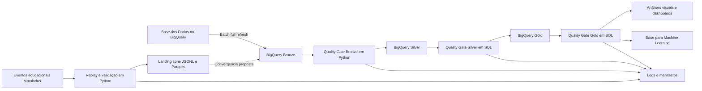

# Alfabetiza Brasil Data Platform

Pipeline híbrida de dados em GCP para integração, tratamento e análise de indicadores de alfabetização infantil no Brasil.

A solução combina ingestão batch, streaming simulado, Arquitetura Medalhão, quality gates, observabilidade e práticas de FinOps utilizando Google Colab, Python, SQL e BigQuery.

> Projeto desenvolvido no contexto do Tech Challenge da Pós-Graduação em Data Science e Inteligência Artificial da FIAP.

---

## Contexto e problema

A alfabetização infantil é um dos principais indicadores do desenvolvimento educacional e social. No Brasil, a análise do Indicador Criança Alfabetizada exige integrar informações distribuídas entre diferentes granularidades e estruturas, como microdados de alunos, resultados territoriais e metas nacionais, estaduais e municipais.

Sem uma plataforma integrada, torna-se mais difícil:

- comparar resultados e metas;
- acompanhar a evolução dos indicadores;
- identificar desigualdades territoriais;
- localizar municípios prioritários;
- garantir consistência e rastreabilidade;
- preparar dados confiáveis para análises e inteligência artificial.

Como referência de consistência, foi utilizado o ponto de corte de **743 pontos na escala de proficiência**, a partir do qual o registro é classificado como alfabetizado na fonte analisada.

---

## Fonte de dados

A principal fonte é o dataset público:

```text
basedosdados.br_inep_avaliacao_alfabetizacao
```

disponibilizado pela Base dos Dados no BigQuery.

Foram integradas sete tabelas:

- `alunos`;
- `dicionario`;
- `meta_alfabetizacao_brasil`;
- `meta_alfabetizacao_uf`;
- `meta_alfabetizacao_municipio`;
- `municipio`;
- `uf`.

O enriquecimento territorial utiliza também o diretório oficial de municípios da Base dos Dados.

Mais detalhes:

- [Dicionário de dados](docs/dicionario_dados.md)

---

## Objetivo

Construir uma plataforma capaz de:

- processar dados históricos por ingestão batch;
- simular eventos em tempo quase real;
- organizar os dados nas camadas Bronze, Silver e Gold;
- integrar informações educacionais e territoriais;
- validar a qualidade antes da progressão entre camadas;
- gerar logs, manifestos e evidências de execução;
- disponibilizar tabelas analíticas para dashboards;
- preparar uma base segura para futuras aplicações de Machine Learning;
- controlar processamento e armazenamento em nuvem.

---

## Arquitetura da solução



> A ligação tracejada representa uma evolução produtiva. Na implementação atual, os eventos simulados permanecem isolados dos dados oficiais para preservar a integridade das fontes públicas.

Documentação:

- [Arquitetura detalhada](docs/arquitetura/arquitetura.md)
- [Decisões técnicas](docs/decisoes_tecnicas.md)
- [Monitoramento e observabilidade](docs/monitoramento/monitoramento.md)
- [Estratégia de FinOps](docs/finops/finops.md)

---

## Camadas da Arquitetura Medalhão

### Bronze

Preserva os dados ingeridos com o mínimo de transformação, mantendo correspondência com as fontes e rastreabilidade da carga.

### Silver

Executa:

- limpeza e padronização;
- conversão de tipos;
- normalização de chaves;
- integração entre entidades;
- enriquecimento territorial;
- preservação de valores ausentes legítimos;
- validações de consistência.

### Gold

Disponibiliza estruturas analíticas para:

- indicadores por município;
- consolidação por UF e Brasil;
- comparação entre metas e resultados;
- evolução temporal;
- resumo regional;
- análise por aluno;
- preparação de dados para Machine Learning.

---

## Pipelines

### 1. Batch

O pipeline batch realiza `full refresh` das sete fontes para a camada Bronze no BigQuery.

A estratégia foi escolhida por simplicidade, rastreabilidade e reprodutibilidade no contexto acadêmico. Em produção, pode evoluir para cargas incrementais.

- [Notebook batch](notebooks/01_pipeline_batch.ipynb)
- [SQL de full refresh](sql/bronze/01_bronze_full_refresh.sql)

### 2. Streaming simulado

O pipeline simula a chegada sequencial de eventos educacionais em tempo quase real.

A execução realiza:

- geração e replay de eventos;
- processamento evento a evento;
- validação de schema e regras de negócio;
- separação entre aceitos e rejeitados;
- persistência em JSONL e Parquet;
- geração de logs, resumo e manifesto.

| Métrica | Resultado |
|---|---:|
| Eventos recebidos | 20 |
| Eventos aceitos | 15 |
| Eventos rejeitados | 5 |
| Formatos gerados | JSONL e Parquet |
| Escrita nos dados oficiais | Não |
| Destino conceitual | Bronze de eventos |

Os eventos aceitos em Parquet representam uma **landing zone simulada**. Em produção, seriam encaminhados para uma Bronze de eventos por serviços como Pub/Sub e um consumidor gerenciado.

- [Notebook de streaming](notebooks/02_streaming_simulado.ipynb)
- [Artefatos do streaming](artifacts/streaming/)

### 3. Pipeline end-to-end

O pipeline principal executa a progressão:

```text
Bronze → Quality Gate → Silver → Quality Gate → Gold → Quality Gate
```

Cada etapa aguarda a conclusão da anterior. Uma reprovação interrompe o fluxo antes da camada seguinte.

Também são registrados:

- identificador da execução;
- início, fim e duração;
- status de cada etapa;
- bytes processados;
- mensagens de erro;
- resultados dos quality gates.

- [Notebook end-to-end](notebooks/03_pipeline_end_to_end.ipynb)

---

## Tecnologias e justificativas

| Tecnologia | Papel | Justificativa |
|---|---|---|
| BigQuery | Bronze, Silver e Gold | Processamento analítico serverless e integração direta com a fonte |
| Google Colab | Desenvolvimento e orquestração | Ambiente acessível e reproduzível para execução acadêmica |
| Python | Batch, streaming, logs e validações | Flexibilidade para orquestração, tratamento de eventos e metadados |
| SQL | Transformações e quality gates | Clareza, auditabilidade e eficiência no BigQuery |
| Parquet | Landing zone do streaming | Formato colunar, comprimido e adequado para processamento analítico |
| JSONL | Eventos e logs estruturados | Formato sequencial simples para replay e inspeção |
| Pandas | Consolidação de resultados | Apoio à inspeção, exportação e análise dos logs |
| Mermaid | Diagrama da arquitetura | Documentação textual, versionável e reproduzível |
| GitHub | Governança do projeto | Branches, commits, Pull Requests e documentação versionada |

---

## Estruturas produzidas

### Bronze — 7 tabelas

- `alunos`
- `dicionario`
- `meta_alfabetizacao_brasil`
- `meta_alfabetizacao_uf`
- `meta_alfabetizacao_municipio`
- `municipio`
- `uf`

### Silver — 7 tabelas

- `alunos`
- `municipio`
- `uf`
- `dim_municipio`
- `meta_alfabetizacao_brasil`
- `meta_alfabetizacao_uf`
- `meta_alfabetizacao_municipio`

### Gold — 6 tabelas e 1 view

- `indicador_municipio`
- `indicador_uf`
- `indicador_brasil`
- `evolucao_municipio`
- `resumo_regiao`
- `aluno_analitico`
- `base_ml_aluno` — view

---

## Resultados da execução

A pipeline foi executada de ponta a ponta com aprovação dos quality gates das três camadas.

| Métrica | Resultado |
|---|---:|
| Registros de alunos ingeridos e preservados | 3.867.999 |
| Registros elegíveis para Machine Learning | 3.354.661 |
| Divisão de treino | 2.347.122 — 69,97% |
| Divisão de validação | 503.191 — 15,00% |
| Divisão de teste | 504.348 — 15,03% |
| Colunas com vazamento direto na base de ML | 0 |
| Quality gates aprovados | Bronze, Silver e Gold |
| Duração aproximada da execução end-to-end | ~85 segundos |
| Volume aproximado processado na execução | ~1 GB |

> Duração e bytes processados são registrados automaticamente nos logs e no `manifest.json` e podem variar entre execuções.

As validações confirmaram:

- correspondência de volume entre origem e camadas tratadas;
- ausência de chaves duplicadas;
- integridade dos relacionamentos territoriais;
- preservação dos valores ausentes da fonte;
- coerência da classificação oficial com o corte de 743 pontos;
- ausência de variáveis diretamente derivadas do alvo na base de Machine Learning.

Evidências:

- [Logs end-to-end](logs/end_to_end/)
- [Resultados dos quality gates](logs/quality_gates/)
- [Artefatos da pipeline](artifacts/pipeline/)

---

## Principais insights

Entre as **5.232 comparações municipais válidas de 2024**:

- **2.788** atingiram ou superaram a meta — **53,29%**;
- **2.444** não atingiram a meta — **46,71%**;
- **120 registros** não possuíam meta disponível;
- **120 registros** não possuíam resultado disponível para comparação.

Os registros de 2023 sem meta alinhada ao mesmo ano foram preservados como ausentes, pois a série analisada de metas começa em 2024. Essas ausências não foram substituídas por zero.

Os rankings e gráficos serão consolidados no notebook de análises visuais.

---

## Qualidade de dados

A solução verifica:

- existência das tabelas;
- correspondência de volume entre origem e Bronze;
- valores ausentes;
- duplicidades;
- unicidade de chaves;
- integridade referencial;
- consistência entre tabelas;
- regras analíticas da Gold;
- ausência de vazamento direto na base de Machine Learning.

### Bronze

O quality gate foi implementado em Python por utilizar metadados e tratamento de exceções da API do BigQuery.

- [Quality gate Bronze](src/quality/validate_bronze.py)

### Silver e Gold

Os quality gates foram implementados em SQL.

- [Quality gate Silver](sql/quality/10_quality_gate_silver.sql)
- [Quality gate Gold](sql/quality/11_quality_gate_gold.sql)

---

## Decisões arquiteturais e trade-offs

- **Full refresh:** simplifica a reprodução e a auditoria, mas não é a estratégia ideal para volumes e frequências maiores.
- **Streaming isolado:** protege os datasets oficiais contra mistura com eventos simulados.
- **Python no quality gate Bronze:** permite consultar metadados e tratar falhas da API.
- **SQL nos quality gates Silver e Gold:** facilita validar relações e regras sobre dados já transformados.
- **Parquet como landing zone:** representa a persistência colunar dos eventos aceitos sem fingir uma infraestrutura gerenciada inexistente.
- **BigQuery em vez de Spark:** o volume atual não justifica a complexidade e o custo operacional de um cluster distribuído.
- **Base de ML como view:** reduz duplicação e mantém a preparação alinhada à tabela analítica por aluno.

Mais detalhes:

- [Decisões técnicas](docs/decisoes_tecnicas.md)

---

## Monitoramento e observabilidade

Cada execução gera:

- logs CSV e JSONL;
- resumo consolidado;
- identificador único;
- manifesto dos arquivos;
- duração e status das etapas;
- volume e bytes processados;
- resultados dos quality gates.

Em uma evolução produtiva, a observabilidade pode ser ampliada com Cloud Logging, Cloud Monitoring, métricas customizadas e alertas automáticos.

- [Monitoramento](docs/monitoramento/monitoramento.md)

---

## FinOps

As principais decisões de eficiência incluem:

- uso do BigQuery serverless;
- seleção apenas das colunas necessárias;
- particionamento de tabelas de maior volume;
- clustering por campos recorrentes de filtro e relacionamento;
- armazenamento colunar em Parquet;
- materialização de estruturas analíticas recorrentes;
- uso de view para a base de Machine Learning;
- interrupção do pipeline em caso de reprovação;
- registro de bytes processados;
- possibilidade de evolução para cargas incrementais.

- [Estratégia de FinOps](docs/finops/finops.md)

---

## Preparação para Machine Learning

A view `gold.base_ml_aluno` contém somente avaliações válidas e utiliza a classificação oficial como variável-alvo:

```text
target_alfabetizado
```

Para reduzir data leakage, foram excluídas:

- proficiência;
- classificação recalculada pelo corte de 743 pontos;
- indicador de coerência entre a classificação oficial e a calculada.

Os identificadores foram preservados para rastreabilidade, mas não devem ser utilizados como variáveis preditoras.

A divisão treino/validação/teste é determinística e reproduzível.

---

## Aplicações futuras em inteligência artificial

A camada Gold pode apoiar:

- predição de alfabetização;
- classificação de risco educacional;
- identificação de municípios prioritários;
- análise de desigualdade territorial;
- agrupamento de municípios com características semelhantes;
- apoio a políticas públicas baseadas em evidências.

---

## Estrutura do repositório

```text
alfabetiza-brasil-data-platform/
├── README.md
├── requirements.txt
├── notebooks/
│   ├── 01_pipeline_batch.ipynb
│   ├── 02_streaming_simulado.ipynb
│   ├── 03_pipeline_end_to_end.ipynb
│   └── 04_analises_visuais.ipynb
├── src/
│   └── quality/
│       └── validate_bronze.py
├── sql/
│   ├── bronze/
│   ├── silver/
│   ├── gold/
│   └── quality/
├── logs/
│   ├── quality_gates/
│   ├── end_to_end/
│   └── streaming/
├── artifacts/
│   ├── pipeline/
│   └── streaming/
├── docs/
│   ├── dicionario_dados.md
│   ├── decisoes_tecnicas.md
│   ├── arquitetura/
│   ├── monitoramento/
│   └── finops/
└── presentation/
```

---

## Como reproduzir

1. Clone ou baixe o repositório.
2. Configure um projeto no Google Cloud.
3. Crie manualmente os datasets `bronze`, `silver` e `gold` no BigQuery, na localização `US`.
4. Acesse os notebooks na ordem indicada.
5. Autentique a conta GCP no Google Colab.
6. Execute o pipeline batch.
7. Execute o streaming simulado.
8. Execute o pipeline end-to-end.
9. Confira os quality gates.
10. Consulte as estruturas analíticas da Gold.

Nenhuma credencial do Google Cloud é versionada neste repositório.

---

## Versionamento e governança

O desenvolvimento utiliza:

- branches separadas por funcionalidade;
- commits claros e descritivos;
- Pull Requests para integração na `main`;
- documentação das decisões técnicas;
- histórico de evolução dos pipelines e artefatos.

---

## Limitações

- O streaming é uma simulação local.
- Os eventos simulados permanecem separados dos dados oficiais.
- O Google Colab não permanece ativo continuamente.
- O projeto não utiliza um orquestrador gerenciado.
- O `full refresh` pode não ser adequado para volumes e frequências maiores.
- As médias regionais não representam taxas oficiais ponderadas por população ou quantidade de alunos.
- Os resultados dependem da cobertura e da qualidade das fontes.
- A arquitetura acadêmica exige adaptações para produção.

---

## Autor

**Matheus Benon Isac**

Projeto desenvolvido como parte do Tech Challenge da Pós-Graduação em Data Science e Inteligência Artificial da FIAP.
