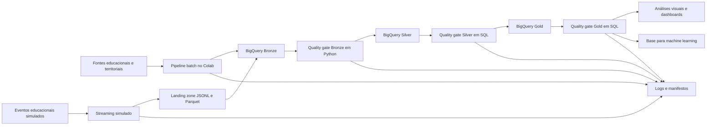

# Arquitetura da Solução

## Objetivo

A arquitetura integra fontes educacionais e territoriais em uma plataforma de dados na GCP, aplicando ingestão híbrida, transformações em camadas e validações de qualidade antes da disponibilização analítica.

## Fluxo principal

## Componentes

### Fontes

A solução integra entidades relacionadas a unidades federativas, municípios, metas nacionais, estaduais e municipais, além de dados educacionais de alunos.

### Ingestão batch

Responsável pela carga periódica das fontes históricas e estruturadas. O notebook batch prepara os dados para a camada Bronze no BigQuery.

### Streaming simulado

Representa a chegada de eventos educacionais em tempo quase real. Os registros são validados e separados entre aceitos e rejeitados, com persistência em JSONL e Parquet.

### Bronze

Camada de dados brutos. Preserva a estrutura recebida e o histórico necessário para rastreabilidade.

### Silver

Camada de dados tratados. Executa limpeza, padronização, normalização de chaves e integração entre fontes.

### Gold

Camada analítica. Disponibiliza tabelas para indicadores por município e UF, comparação entre metas e resultados, evolução temporal e preparação de dados para machine learning.

### Quality gates

- **Bronze:** existência de tabelas, contagens e metadados.
- **Silver:** duplicidades, nulos, tipos, chaves e consistência.
- **Gold:** integridade das tabelas analíticas e regras de negócio.

### Logs e manifestos

Cada execução produz registros operacionais, resumos e manifestos que permitem rastrear status, arquivos gerados, volumes e identificadores de execução.

## Separação entre dados oficiais e simulados

Os eventos de streaming simulado são mantidos separados das fontes oficiais. Essa decisão evita que dados sintéticos alterem os indicadores educacionais usados nas análises finais.
